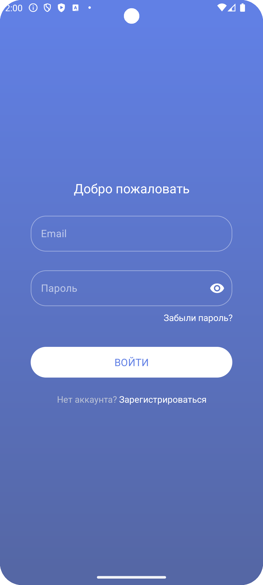
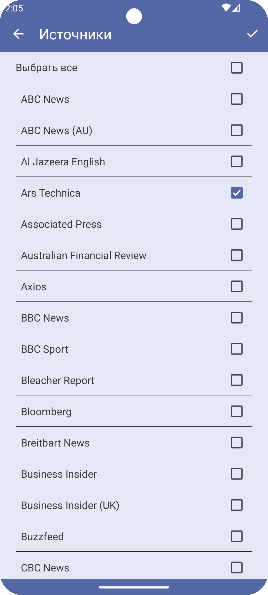

# News 
An app for Android, client for  News API. [News API](https://newsapi.org/) is a simple HTTP REST API for searching and retrieving live articles from all over the web.

## Features

- 14 languages
- 50+ news sources
- Search by highlight words
- Saving important news

## Screenshots

## Requirements

- API level 26 and highter

## Tools

- Retrofit 2
- Firebase
- Glide
- MVVM
- Jetpack Navigation
- [News API](https://newsapi.org/)
- [GestureViews](https://github.com/alexvasilkov/GestureViews)
- [TabSync](https://github.com/Ahmad-Hamwi/TabSync)
